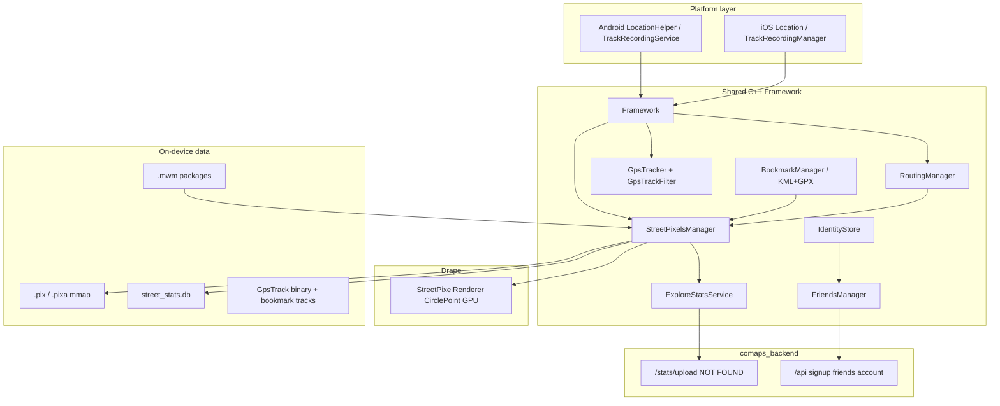
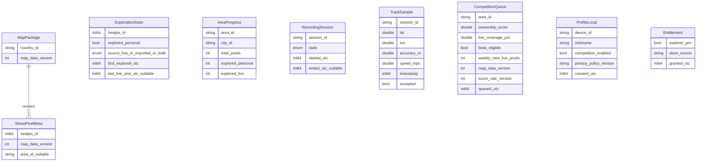

# Street Pixels — Technical Audit and Feasibility Review

**Document status:** Living technical audit  
**Product source of truth:** `docs/STREET_PIXELS_PRODUCT_SPEC.md` (V1)  
**Repositories inspected:** `comaps` (client), `comaps_backend` (API)  
**Audit date:** 2026-07-20  

Status vocabulary used throughout:

| Status | Meaning |
| --- | --- |
| **Confirmed** | Concrete production-shaped code or config found |
| **Partially confirmed** | Present but incomplete, platform-skewed, legacy, or mismatched to the product spec |
| **Not found** | Searched; no evidence |
| **Unclear — requires spike** | Source inspection insufficient; experiment required |
| **Incompatible with current architecture** | Direct conflict with existing design unless product or architecture changes |

Distinction used in findings:

- **Code does** — observed behaviour in current sources  
- **Docs claim** — product specification requirement  
- **Inference** — reasoned from code structure, not measured  
- **Needs device test** — cannot be concluded from repository inspection alone  

---

## 1. Executive summary

Street Pixels is **not a greenfield idea inside this codebase**. A substantial shared C++ implementation already exists: HEALPix street pixels (`nside=1048576`), on-device derivation from MWM highway geometry, GPU circle overlays via Drape, SQLite exploration bitmasks, prefer-unexplored routing multipliers, GPS track recording with Android foreground service and iOS Live Activities, and WIP explore/friends identity sync.

That existing work is a strong foundation for the **personal offline exploration** half of V1, but it **does not yet match the product specification** on several launch-critical points:

1. **Recording gate missing (critical):** `Framework::OnLocationUpdate` always forwards GPS into `StreetPixelsManager::OnLocationUpdate`, which marks pixels explored with **no** check that a user-started recording session is active. This contradicts product principles §3.3 / §11.1.
2. **Map updates wipe exploration (critical):** `CleanupStreetPixels` deletes `.pix` / `.pixa` / stats for a country on download. Spec §27 requires rematching explored HEALPix IDs.
3. **No neighborhood administrative substrate:** Runtime “areas” are MWM country IDs and city **box approximations**, not OSM neighborhood polygons. Spec §8’s “smallest suitable administrative subdivision” is **not supported by retained map data**.
4. **Avoid-explored routing not implemented:** Only soft prefer-unexplored multipliers exist (`IStreetExplorationWeights` → up to ~10× weight). Hard exclusion with controlled fallback is absent.
5. **Competition backend incomplete:** Client posts to `/stats/upload`; backend has friends/account only — no ownership, decay, weekly leaderboards, or area rankings.
6. **iOS product surface missing:** Shared C++ core exists; Street Pixels / explore / friends UI wiring on iOS was **not found**.
7. **Friends work conflicts with V1 non-goals:** Spec §6 excludes friend requests; Android + `comaps_backend` already implement friends.

**Overall assessment: Go with major conditions.**  
Personal exploration on Android can be brought toward V1 by adapting existing Street Pixels code. Competition, neighborhood areas, map-update rematch, recording semantics, iOS parity, and Explorer Pro are conditional on product clarifications and the spike backlog below. Do not treat current explore/friends WIP as the competition design.

---

## 2. Audit scope and source material

### In scope

- Shared engines under `libs/`
- Android app + SDK under `android/`
- iOS app under `iphone/` and `xcode/`
- Map generator under `generator/` and classificator under `data/`
- Vendored deps under `3party/` (especially HEALPix, SQLite)
- Backend under `/Users/mo/dev/comaps_backend`
- Product spec `docs/STREET_PIXELS_PRODUCT_SPEC.md`

### Out of scope for this audit

- Full feature implementation
- Polished UI/UX design
- Calendar estimates
- Editing the product specification

### Spec defaults used as comparison baselines

| Parameter | Spec V1 default |
| --- | --- |
| Path sampling | ~10 m |
| Collection radius | 25 m |
| GPS accuracy gate | ≤ 25 m |
| Max implied speed | 50 km/h |
| Interpolation caps | ≤ 30 s and ≤ 200 m |
| Ownership half-life | ~30 days |
| Boss eligibility | ≥2% live pixels, ≥50 unique (waived if area &lt;50), recency-weighted ≥0.5% |
| Upload cadence | ≤ once / 15 min + ≤15 min jitter |
| Nickname | 3–24 chars, Unicode |
| Explorer Pro | One-time; gates GPX tools only |

### Spec document defects noted (not fixed here)

- Empty LaTeX for area completion formula (§7), ownership formula (§22.4), contested-state formula (§22.9).
- These gaps block precise competition implementation until clarified.

---

## 3. Repository overview

### Languages and layout — **Confirmed**

| Layer | Languages / tools | Paths |
| --- | --- | --- |
| Shared core | C++23, CMake | `libs/`, root `CMakeLists.txt` |
| Android | Java app + JNI SDK, Gradle | `android/app/`, `android/sdk/` |
| iOS | ObjC++ / Swift, Xcode | `iphone/Maps/`, `xcode/` |
| Desktop | Qt | `qt/` |
| Map generation | C++ generator | `generator/` |
| Styles / classificator | CSV, MapCSS, binary data | `data/` |
| Backend | Python 3.12+, Django 5.2, django-ninja | `comaps_backend/` |
| License | Apache 2.0 | `LICENSE`, `NOTICE` |

### Shared versus platform-specific

- **Shared:** map engine (`libs/map`), Drape renderer (`libs/drape`, `libs/drape_frontend`), routing (`libs/routing`, `libs/routing_common`), storage (`libs/storage`), indexer (`libs/indexer`), KML/GPX (`libs/kml`), Street Pixels manager and renderer.
- **Platform:** location providers, foreground/background services, UI, billing hooks, permissions, notifications, Live Activities.

### Existing Street Pixels–related WIP (already in tree)

| Component | Path |
| --- | --- |
| Pixel manager | `libs/map/street_pixels_manager.{hpp,cpp}` (~1k LOC) |
| Stats DB | `libs/map/street_stats_db.{hpp,cpp}` |
| Routing adapter | `libs/map/street_exploration_routing_adapter.{hpp,cpp}` |
| GPU overlay | `libs/drape_frontend/street_pixel*.{hpp,cpp}` |
| Explore stats upload | `libs/map/explore_stats_service.{hpp,cpp}` |
| Identity | `libs/map/identity_store.{hpp,cpp}` |
| Friends | `libs/map/friends_manager.{hpp,cpp}` |
| API base | `libs/map/backend_config.{hpp,cpp}` |
| Android layer mode | `android/sdk/.../maplayer/Mode.java` (`STREET_PIXELS`) |
| Android consent / account UI | `ExploreConsentDialogFragment`, `MyAccountDialogFragment` |

---

## 4. Current architecture



### Engines — **Confirmed**

| Concern | Implementation |
| --- | --- |
| Map / orchestration | `libs/map/framework.{hpp,cpp}` |
| Rendering | `libs/drape/` (GL/Vulkan/Metal), `libs/drape_frontend/` |
| Routing | `libs/routing/` IndexRouter + pedestrian/bicycle models |
| Map packages | `libs/storage/` downloads / diffs; `*.mwm` |
| Generator | `generator/` OSM → country/world/coasts |

### Persistence today

| Store | Role |
| --- | --- |
| `{countryId}.pix` | Sorted HEALPix ids; MSB = explored; 8 bytes/pixel; mmap |
| `{countryId}.pixa` | Accounted-bits for stats |
| `street_stats.db` | Per-feature exploration bitmasks + processed track hashes |
| GpsTrack file | Recent track samples via `GpsTracker` |
| KML/GPX bookmarks | Persistent tracks / import-export |
| Settings / SecureStorage | Username, consent, device id, routing options, API URL |

### Networking

- HTTP helpers: `libs/platform/http_*`
- Map downloads: `libs/storage/`
- Explore upload: `ExploreStatsService::TryUpload` → `backend::GetStatsUploadUrl()`
- Default API base: hardcoded LAN URL `http://192.168.178.89:8999/api` in `backend_config.cpp` — **not production-ready**

### Third-party relevant to Street Pixels

| Library | Path | Relevance |
| --- | --- | --- |
| HEALPix | `3party/healpix/` | Pixel IDs — **Confirmed used** |
| SQLite | `3party/sqlite/` | `street_stats.db` |
| Open Location Code | `3party/open-location-code/` | Search only — not exploration grid |
| Sentry | Android Gradle + `AndroidManifest.xml` meta-data | Crash/telemetry — privacy concern |

### Licensing — **Confirmed**

Apache 2.0 (`LICENSE`). Forking and distributing Street Pixels as a CoMaps-derived app is legally feasible under Apache-2.0 with attribution via `NOTICE`. Vendor licenses under `3party/*/LICENSE` must continue to be honored. **Inference:** HEALPix/libsharp CFITSIO licensing needs inclusion in redistribution notices (present under `3party/healpix/`).

---

## 5. Feature-reuse matrix

| Capability | Existing CoMaps implementation | Evidence | Reuse classification | Required changes | Risk | Spike needed |
| --- | --- | --- | --- | --- | --- | --- |
| Offline map viewing | Full MWM viewer | `libs/map/framework.*`, `libs/storage/` | Direct reuse | Branding / layer defaults | Low | No |
| Eligible-route filtering | `IsExplorable` highway + hwtag filter | `StreetPixelsManager::IsExplorable` | Reuse with substantial extension | Align with spec eligibility (steps, ferry, indoor, motorway+bicycle, tunnel policy) | Medium | Partial |
| Street-pixel generation | On-device derive from MWM lines | `DeriveStreetPixelsFromFeatures` | Reuse with small adaptation | Sampling 15→10 m; store map-data version | Medium | No |
| HEALPix or spatial indexing | HEALPix nside=1048576 NEST | `hp::GetHealpixBase()`, `3party/healpix/` | Direct reuse | Possibly tune nside; document cell size | Low | Optional |
| Pixel overlay rendering | GPU `CirclePoint` buckets at z15 | `StreetPixelRenderer` | Reuse with small adaptation | Perf validation at city scale; LOD/policy | High | **Yes** |
| Incremental red-to-green updates | MSB flip + `msync` + renderer update | `OnLocationUpdate`, `UpdatePixels` | Direct reuse | Gate on recording session | Medium | No |
| Area boundaries | City box approximations only | `indexer::CityBoundary`, `CitiesBoundariesTable` | Currently infeasible for neighborhoods | New admin pipeline or product change | Critical | **Yes** |
| Area assignment | Not found for neighborhoods | Spec §8 vs MWM country id usage | New implementation | Deterministic polygon assignment + generator retention | Critical | **Yes** |
| Area completion | Fraction by country `.pix` | explored count / total in manager | Reuse with substantial extension | Area-scoped denominators | High | Yes |
| City completion | Partially via MWM region | country-level stats | Reuse with substantial extension | City polygon membership | High | Yes |
| Explicit recording sessions | Track start/stop exists | `GpsTracker`, `TrackRecordingService`, iOS `TrackRecordingManager` | Reuse with substantial extension | Gate pixel collection; add pause/resume/discard | High | **Yes** |
| Pause and resume | **Not found** | Start/stop only | New implementation | Session state machine | Medium | No |
| Background recording | Android FGS + iOS location mode | `TrackRecordingService`, `UIBackgroundModes=location` | Reuse with small adaptation | Align permissions/copy with Street Pixels; OEM testing | High | **Yes** |
| Screen-off recording | Intended via FGS / Always location | Same as above | Unknown pending spike | Device matrix testing | High | **Yes** |
| Track persistence | GpsTrack + bookmarks | `GpsTrackStorage`, KML | Direct reuse | Session metadata; live vs import flags | Low | No |
| GPS filtering | `GpsTrackFilter` (track path) | `gps_track_filter.cpp` defaults 250 m accuracy | Reuse with substantial extension | Spec thresholds; apply to live pixel path | High | **Yes** |
| Interpolation | GPX timestamp fill; location extrapolator | `serdes_gpx.cpp`, `extrapolator.cpp` | Reuse with substantial extension | Spec caps; no interpolate across pause | Medium | **Yes** |
| Jump rejection | Acceleration / direction checks in track filter | `GpsTrackFilter::IsGoodPoint` | Reuse with substantial extension | Unify with 50 km/h rule | Medium | Yes |
| Prefer-unexplored routing | Soft weight multiplier | `ApplyStreetExplorationMultiplier`, Android driving options | Direct reuse | Expose walk/bike UX; tune strength | Medium | Optional |
| Avoid-explored routing | **Not found** | Multiplier only, never hard block | New implementation | Hard exclude + fallback policy | High | **Yes** |
| GPX import | Full KML/GPX pipeline | `DeserializerGpx`, Android multi-URI import | Reuse with substantial extension | Mark imported; Explorer Pro gate; competition isolation | Medium | **Yes** |
| GPX export | SerializerGpx | `libs/kml/serdes_gpx.*` | Reuse with small adaptation | Explorer Pro gate | Low | No |
| Map-data updates | Manual download / diffs | `Storage`, `OnCountryFileDownloaded` | Direct reuse | Rematch instead of delete | Critical | **Yes** |
| Exploration migration after updates | Deletes `.pix` | `CleanupStreetPixels` | Currently infeasible as-is | Rematch explored IDs; recalc areas | Critical | **Yes** |
| Local competition identity | Device id + username | `IdentityStore`, signup API | Reuse with substantial extension | Nickname rules; consent version; drop friends-first UX | Medium | No |
| Delayed aggregate synchronization | Weekly deltas + upload attempt | `ExploreStatsService` | Reuse with substantial extension | 15 min cadence + jitter; competition schema | Medium | **Yes** |
| Competition backend | Friends/account only | `comaps_backend/apis/api.py` | New implementation | Ownership, decay, boards, moderation | High | No (design) / Yes (proto) |
| Server-side score decay | **Not found** | Spec §22.8 | New implementation | Store last score + time + version | Medium | No |
| Weekly city leaderboard | Client weekly buckets only | `ExploreStatsService` entries | New implementation | City scope + server aggregation | Medium | No |
| Nickname moderation | **Not found** | — | New implementation | Report + admin reset | Low | No |
| Profile deletion | `DELETE /account` | `AccountController.delete_account` | Reuse with small adaptation | Delete competition aggregates too | Low | No |
| One-time Explorer Pro purchase | Android billing **Not found**; iOS StoreKit legacy | `InAppPurchase/` | New implementation | Shared entitlement + both stores | High | No |
| Completion-card generation | **Not found** | Generic share of tracks only | New implementation | Compose map + stats image | Medium | No |
| Privacy-conscious analytics | Sentry with PII/screenshots enabled | `AndroidManifest.xml` Sentry meta-data | Reuse with substantial extension | Disable PII/screenshots; isolate competition | High | No |

---

## 6. Map-data and street-pixel generation

### How CoMaps obtains and packages map data — **Confirmed**

1. OSM ingest / filter: `generator/osm_source.*`, `generator/filter_elements.*`
2. Feature generation: `generator/feature_generator.*`, `raw_generator.*`
3. Outputs: country MWMs, world, coasts
4. Client download: `libs/storage/` with data version via `Storage::GetCurrentDataVersion` / `countries.txt` / `X-OM-DataVersion`

### Street pixels today — **Confirmed**

- **Not** produced in the generator.
- Derived **on device** after MWM load: `DeriveStreetPixelsFromFeatures` samples explorable line geometries every **15 m**, assigns HEALPix cells, writes `{country}.pix`.
- Explorable rule (`IsExplorable`): line geometry; classificator path starts with `highway`; excludes `driveway` and `tunnel` subtypes; excludes `hwtag=private`; requires bike **or** pedestrian accessibility via hwtag.

### Spec eligibility vs code

| Spec requirement | Code status |
| --- | --- |
| Public streets, cycleways, footways, paths, service, steps, tracks, informal | **Partially confirmed** — depends on what survives as `highway=*`; steps/tracks likely included if typed as highway |
| Bridges included | **Unclear — requires spike** — bridge may be attribute not subtype; tunnel explicitly excluded |
| Motorways only if bicycle-explicit | **Not found** as special case — motorways included if not private and bike/foot accessible flags allow |
| Exclude private / indoor / underground / ferry / proposed / construction | **Partially confirmed** for private; others **Not found** as explicit filters in `IsExplorable` |
| Tags surviving generation | hwtag yesfoot/nofoot/yesbicycle/nobicycle/private in `data/mapcss-mapping.csv` — **Confirmed** |

### Generation placement recommendation

| Option | Assessment |
| --- | --- |
| During map-build pipeline | Possible later for faster first open; not required for V1; increases generator maintenance |
| During download/install | Overlaps on-device derive; OK |
| On first use of country | **Current behaviour — Confirmed** |
| Incremental on-device | Already incremental for exploration bits |
| Hybrid | Recommended long-term: generator can precompute pixel lists; client still owns explored state |

**Recommendation:** Keep on-device derivation for V1 (already works), tighten `IsExplorable`, then consider optional generator precomputation as an optimization after eligibility is stable.

### Map version and history survival

- Pixel file stores HEALPix id + explored bit only — **no map-data version field** (**Confirmed**).
- On country download success, framework calls `CleanupStreetPixels` which **deletes** pixel files and DB rows (**Confirmed**, `framework.cpp` → `CleanupStreetPixels`).
- Spec rematch requirement is **Incompatible with current architecture** until rematch replaces delete.

Stable HEALPix IDs **can** reconcile across builds **if** eligibility geometry still intersects the same cells — **Inference**. Deleted ways drop cells; new ways add red cells. Rematch of the explored bitset against the new `.pix` list is the correct migration, not full wipe.

---

## 7. Rendering feasibility

### Current approach — **Confirmed**

- Representation: one GPU circle per HEALPix cell (`df::StreetPixel`, `gpu::Program::CirclePoint`).
- Color from explored bit (red/green).
- Tiling: bucketed at zoom 15; hidden below zoom 9; radius table by zoom (`kRadiusInPixel`).
- Updates: mmap’d array; explored bit flipped with `msync`; renderer receives pixel spans.

### Strategy comparison

| Strategy | Fit to current code | Pros | Cons | Verdict |
| --- | --- | --- | --- | --- |
| 1. One marker/shape per cell | **Already implemented** | Simple; incremental | Fill-rate / upload cost at city scale | **Provisional primary** pending spike |
| 2. Batched points/polygons | Same family as (1) | Better batching | Still O(visible cells) | Incremental improvement |
| 3. Generated vector tiles | **Not found** for pixels | Style integration | Heavy pipeline; update cost | Defer |
| 4. Raster overlay tiles | **Not found** | Cheap draw | Blurry; remake on explore | Hybrid at low zoom later |
| 5. Sampled road segments | Possible via feature geometry | Looks like streets | Harder incremental green | Alternative if circles fail |
| 6. Hybrid by zoom | Partial (hide &lt;z9, buckets z15) | Scalable | Complexity | Likely needed if (1) fails spike |

### Performance expectations — **Inference** (needs spike)

Assumptions: ~12 m effective spacing along eligible roads; 8 bytes/pixel.

| Region scale | Approx. valid pixels | `.pix` size | Risk when all visible |
| --- | --- | --- | --- |
| Medium city (~800 km eligible) | ~7×10⁴ | ~0.5 MB | Moderate at mid zooms |
| Large city (~4000 km) | ~3×10⁵ | ~2.7 MB | High without aggressive culling |
| Mega metro (~12000 km) | ~1×10⁶ | ~8 MB | Critical without LOD/hybrid |

Hundreds of thousands of **stored** cells are plausible. Hundreds of thousands **simultaneously rendered** as individual circles is **Unclear — requires spike**.

Hit testing for area selection: general `TapEvent` / overlay picking exists; **no dedicated street-pixel hit-test API** — **Partially confirmed**. Area selection should use admin polygons, not pixel picking.

**Provisional recommendation:** Keep GPU circle-per-cell with tile buckets; add zoom-dependent thinning or raster tiles if spike fails pass criteria.

---

## 8. Recording and location feasibility

### What code does today — **Confirmed**

| Capability | Android | iOS |
| --- | --- | --- |
| Start/stop track recording | `TrackRecorder` + `TrackRecordingService` foreground notification | `TrackRecordingManager` (+ Live Activity) |
| Pause/resume/discard | **Not found** | **Not found** |
| Background location mode | FGS type `location`; **no** `ACCESS_BACKGROUND_LOCATION` in manifest | `UIBackgroundModes` includes `location`; Always/WhenInUse strings exist |
| Sample fields | `location::GpsInfo` timestamp, lat/lon, h/v accuracy, altitude, bearing, speed, source | Same via shared type |
| Persistent notification | Yes (`TRACK_REC_NOTIFICATION_ID`) | System location indicator / Live Activity |
| Pixel collection gated on recording | **No** — always on location updates | Same shared C++ |

### Critical product conflict

**Docs claim:** pixels only during explicit recording (§3.3, §11.1).  
**Code does:** `Framework::OnLocationUpdate` → `m_streetPixelsManager->OnLocationUpdate(rInfo)` unconditionally (`framework.cpp`).  
**Status:** **Incompatible with current architecture** until a session gate is added.

### Android risks — **Confirmed / Needs device test**

- Foreground service required for reliable background tracking — already used.
- Absence of `ACCESS_BACKGROUND_LOCATION` may be OK while FGS runs; OEM killers still apply — **Needs device test**.
- Doze / app standby / force-stop can terminate recording — **Needs device test**.
- Permission model changes across Android versions — documented partially in `docs/ANDROID_LOCATION_TEST.md`.

### iOS risks — **Confirmed / Needs device test**

- Always vs While Using: strings exist; Street Pixels will need accurate App Store justification tied to user-started sessions.
- Blue status-bar / indicator while using background location — expected.
- App suspension / termination: session restoration for exploration not designed — **Not found**.
- Live Activity shows distance/duration, not pixel progress.

### Recommendation

Build a **Street Pixels session state machine** on top of existing track recording:

`Idle → Recording → Paused → Finished | Discarded`

Only `Recording` feeds the collection engine. Reuse FGS / background location for continuity; add pause that stops both track append and pixel collection without interpolating across the gap.

---

## 9. GPS validation and interpolation

### Current track filter — **Confirmed** (`GpsTrackFilter`)

| Rule | Default |
| --- | --- |
| Min horizontal accuracy | **250 m** (`kMinHorizontalAccuracyMeters`) — far looser than spec 25 m |
| Close-point decimation | 10 m |
| Max acceleration | 2 m/s² |
| Direction vs prediction | cos ≥ 45°, distance gate |
| Reject predictor points | yes |
| Require `HasSpeed()` | yes |

### Live pixel path — **Confirmed gap**

`StreetPixelsManager::OnLocationUpdate` applies **no** accuracy, speed, staleness, or jump checks. It collects all HEALPix cells in `kExploreRadiusMeters` (20 m) around the raw fix.

### Spec vs code numeric mismatches

| Parameter | Spec | Code |
| --- | --- | --- |
| Explore radius | 25 m | 20 m |
| Path sampling (derive) | ~10 m | 15 m |
| Path sampling (track replay) | — | ~10 m in places — inconsistent |
| Accuracy gate | 25 m | 250 m on tracks; none on live pixels |
| Max speed | 50 km/h | acceleration heuristic instead |

### Proposed acceptance pipeline (recommendation)

```text
Raw GpsInfo
  → reject if recording not active / paused / interrupted
  → reject if !hasAccuracy or accuracy > 25 m
  → reject if stale / invalid timestamp
  → reject if implied speed > 50 km/h from last accepted
  → reject teleports / failed direction-acceleration checks
  → if gap from last accepted ≤ 30 s AND ≤ 200 m AND speed OK:
        emit interpolated samples (not across pause/reject/interrupt)
  → for each accepted (+ interpolated) sample:
        collect valid street pixels within 25 m
  → persist: raw optional debug log; accepted samples for track; pixel events with source=live
```

**Where it should live:** new collection filter used by Street Pixels; optionally tighten `GpsTrackFilter` defaults or share helpers. Do not silently reuse 250 m track defaults for competition-grade collection.

**Raw vs accepted retention:** retain accepted track for user export; raw optional behind debug. Competition must never upload either.

**Configurability:** ship spec defaults as compile-time constants initially; allow remote/config only after abuse/tuning evidence (accuracy, speed, radius).

**Tests required:** unit tests with synthetic GPS sequences; field tests walking/cycling with intentional tunnels, indoor transitions, and vehicle passengers (false exploration).

---

## 10. Administrative-area feasibility

### What map data retains — **Confirmed**

- `boundary=administrative` levels **2–4** kept; levels **7, 9, 10, 11** deprecated in `data/mapcss-mapping.csv`.
- City boundaries stored as **three approximating boxes** (`CityBoundary`: bbox ∩ calipers ∩ diamond), not full OSM polygons at runtime (`libs/indexer/city_boundary.hpp`).
- `place=suburb|neighbourhood|quarter` exist as **place types** for search/labels — **not** as exploration polygons in `CitiesBoundariesTable`.

### Spec requirement vs reality

| Spec need | Status |
| --- | --- |
| City detection via municipal boundary | **Partially confirmed** — locality boxes, not full polygons |
| Smallest suitable neighborhood polygon | **Not found** / **Incompatible with current architecture** without generator changes |
| Pixel → single area assignment | **Not found** |
| Area hit testing / rendering | **Not found** for neighborhoods |
| Global “smallest suitable subdivision” rule | **Unrealistic** on current data — OSM admin completeness varies wildly |

### Geographic edge cases requiring product refinement

- Cities without admin_level 8–10 subdivisions (common outside Europe).
- Overlapping/disputed boundaries.
- Unincorporated urban areas.
- Coastal / island municipalities with fragmented polygons.
- Cities where only admin_level 6/8 exist inconsistently named.
- “Borough” vs “neighbourhood” semantics differ by country.

### Recommended deterministic algorithm (if polygons are added)

1. Generator retains named polygonal admin boundaries for configurable levels (e.g. 8–10) plus municipal city polygons.
2. Build city → child subdivision containment offline.
3. For each street pixel centroid: among subdivisions of the containing city, choose the **smallest-area** polygon that contains the point; ties broken by stable OSM id / name sort.
4. If no subdivision contains the point but city does → assign city fallback area.
5. If outside any city → personal exploration only; no competition area id.
6. Persist `area_id` + `map_data_version` with pixels or in a side table; recompute on map update.

Until polygons exist, **do not pretend MWM country ids are neighborhoods**.

---

## 11. Local storage and data model

### Reuse — **Confirmed**

Prefer extending the existing Street Pixels stores rather than introducing a second parallel DB:

- `.pix` / `.pixa` for valid cell universe + personal explored bit (fast mmap render path)
- SQLite (`street_stats.db` pattern) for richer metadata
- Settings/SecureStorage for consent, entitlement, identity

### Preliminary data model



### Storage growth (assumptions stated)

Assumptions: ~12 m effective unique spacing; 8 bytes per `.pix` entry; explored state stored in-place via MSB (no extra per explored pixel in `.pix`).

| Scenario | Approx. valid pixels | On-disk `.pix` |
| --- | --- | --- |
| Medium city | ~7×10⁴ | ~0.5 MB |
| Large city | ~3×10⁵ | ~2.7 MB |
| User 1 year casual (~100 km unique) | explored subset small | negligible vs base `.pix` |
| Heavy multi-year (~2000 km unique) | ~1.7×10⁵ explored bits | still within same country files |

**Inference:** base valid-pixel files dominate storage, not years of history, **as long as** explored state remains a bit on the cell list. Rich per-pixel timestamps for **all** cells would change this — avoid storing per-pixel competitive timestamps for every cell; store sparse live-recency only for cells needed for ownership or aggregate on the fly into area scores.

### Concurrency

`StreetStatsDB` uses a recursive mutex; `.pix` uses shared mutex + `msync`. Renderer reads spans — **Partially confirmed** thread design; needs careful review when adding session gating and rematch migrations.

---

## 12. Routing feasibility

### Engine — **Confirmed**

On-device IndexRouter with pedestrian and bicycle vehicle models (`PedestrianModel`, `BicycleModel`), edge weights via `EdgeEstimator`.

### Prefer unexplored — **Confirmed**

- `IStreetExplorationWeights::GetSegmentWeightMultiplier`
- `StreetPixelsManager` maps segment geometry → matched pixels → `exploredRatio`
- Multiplier: `1 + strength * 9 * exploredRatio` (up to ~10×)
- Settings: `StreetExplorationRoutingOptions` (enabled + strength 0–100)
- Android UI: `DrivingOptionsFragment` / car screen toggle

This matches V1 **prefer unexplored** as a soft bias.

### Avoid explored — **Not found**

No hard exclusion API found. Returning an infinite weight or removing edges would be a **new** extension. Risks:

- Disconnected unexplored components → no route
- Extremely long detours
- Instability as user explores mid-navigation
- Per-segment pixel lookup cost (already paid for prefer mode)

**Minimum spike:** implement “avoid” as very large finite penalty first; add true exclusion only with mandatory fallback to prefer/normal when `NoRoute`.

### Other notes

- Alternatives: general router supports alternatives in places — exploration-specific alternatives **Unclear**.
- Imported exploration currently affects the same explored bit used for routing — **Confirmed** conflict with spec (“imported affects personal routing but not competition”). Need separate live/import flags for competition; routing may still use personal explored set (product choice — clarify).

**Major uncertainty remains** for hard avoid mode despite soft prefer existing.

---

## 13. GPX tooling

### Existing — **Confirmed**

- Import/export via `libs/kml/serdes_gpx.*` with substantial tests (`libs/kml/kml_tests/gpx_tests.cpp`)
- Android batch import through multi-URI `importBookmarksFiles`
- Import triggers `UpdateExploredPixels` / track replay into pixels

### Gaps vs spec

| Requirement | Status |
| --- | --- |
| Personal pixels green | **Confirmed** (same explored bit) |
| Mark imported | **Not found** |
| No competitive recency | **Not found** (no recency model yet; explore stats may count track pixels — **Unclear**) |
| Explorer Pro gate | **Not found** — GPX currently free |
| Separate historical policy | Track replay ≠ live filter; needs explicit imported pipeline |

**Recommendation:** process GPX through a dedicated importer that sets `source=imported`, never touches `last_live_visit`, never enqueues competition uploads. Do not reuse live session interpolation rules blindly (historical timestamps / sparse points differ).

---

## 14. Map updates and migrations

### Current behaviour — **Confirmed**

- Updates are user-driven downloads (not silent auto-replace of exploration).
- Diffs supported (`mwm_diff`, `Storage::ApplyDiff`).
- On success: `CleanupStreetPixels` deletes exploration artifacts; next load regenerates all-red `.pix`.

### Required migration strategy (recommendation)

1. Keep old `.pix` aside as `explored_ids` set during update.
2. Build new valid pixel list from new MWM.
3. For each new cell id present in old explored set → mark explored; preserve imported/live flags via side table keyed by HEALPix id.
4. Reassign areas for new version.
5. Recompute denominators; show UX that percentages may drop because denominator grew.
6. Run on background thread; allow map browse with “updating exploration…” state.
7. On failure: keep previous `.pix` + previous MWM if package rollback available; never leave empty explored state without backup.

**Status of rematch today:** **Incompatible with current architecture** (delete-first).

---

## 15. Competition and backend feasibility

### Backend today — **Confirmed** (`comaps_backend`)

| Piece | Detail |
| --- | --- |
| Stack | Django 5.2 + django-ninja-extra |
| Models | `Explorer(device_id)`, `Friendship` only |
| Auth | `DeviceIdAuth` via `X-Device-Id` + `X-Username` headers |
| Endpoints | signup, update_username, account export/delete, friends CRUD |
| Throttles | signup 5/h, username 10/h, delete 3/h, friends search/actions |
| `/stats/upload` | **Not found** (client expects it) |
| Ownership / decay / boards | **Not found** |

### Client precursor — **Partially confirmed**

`ExploreStatsService` aggregates weekly `regionId` pixel deltas and attempts upload. Poll interval ~1 min (spec wants ≤15 min + jitter). Payload is not ownership scores.

### Friends vs V1

Spec §6: friend requests are non-goals. Backend + Android friends are a **product conflict**. Treat as parallel experiment; do not block Street Pixels V1 on friends.

### Provisional API outline (not implemented)

```text
POST /api/v1/competition/register
  body: device_id, nickname, consent{policy_version, timestamp}
POST /api/v1/competition/nickname
POST /api/v1/competition/upload
  body: profile_id, map_data_version, score_calc_version,
        areas[{area_id, ownership_score, live_coverage_pct, eligible, updated_at}],
        weekly_city[{city_id, new_live_pixels, week_id}]
GET  /api/v1/competition/areas/{area_id}
GET  /api/v1/competition/cities/{city_id}/weekly
POST /api/v1/competition/nickname/report
DELETE /api/v1/competition/profile
```

Never accept: raw GPS, tracks, exact location, per-pixel timestamps, live activity.

### Client-trust model (V1 honesty)

| Trusted enough for V1 | Easily spoofed |
| --- | --- |
| Opt-in consent records | Device id / forged uploads |
| Aggregate area scores as submitted | Inflated coverage / weekly counts |
| Server-side decay between uploads | Emulators / mocked location before upload |
| Sparse-area anonymity presentation | Sybil nicknames |

Do **not** build sophisticated anti-cheat in V1 (matches spec). Rate-limit, schema-validate, clamp impossible percentages, and accept residual cheating risk.

### Decay from aggregates

Server stores `(score, observed_at, decay_version)`. Between uploads apply exponential half-life (~30 d). Next client upload replaces decayed estimate. This is feasible **without** per-pixel timestamps — **Confirmed as design**, not implemented.

### Profiles across reinstall

Device id in SecureStorage can survive backup/restore sometimes; reinstall often creates a new profile — matches spec “no cross-device recovery in V1”.

---

## 16. Monetization and sharing

| Topic | Status |
| --- | --- |
| Google Play Billing | **Not found** in Android sources |
| Apple IAP | **Partially confirmed** — legacy `InAppPurchase` / StoreKit; not Explorer Pro |
| Entitlement abstraction | **Not found** for Explorer Pro |
| Offline entitlement cache | **Not found** |
| Share / completion cards | **Not found** — no neighborhood share compositor |

Explorer Pro requires **new** billing on Android, revival/adaptation of iOS IAP, shared `EntitlementStore`, and feature gates around GPX tools only (competition remains free per spec).

Receipt validation: optional for V1 one-time unlock; if offline-first, cache locally and accept some piracy risk rather than blocking core exploration.

---

## 17. Privacy, analytics, and security

### Product promise

Private by default; no competition uploads without consent; no raw GPS uploads.

### Current behaviour conflicts / risks

| Finding | Status | Evidence |
| --- | --- | --- |
| Sentry enabled with `send-default-pii=true`, screenshots, view hierarchy, traces sample rate 1.0 | **Confirmed** | `android/app/src/main/AndroidManifest.xml` |
| Legacy `tracking::Reporter` | Comment says currently unused | `libs/tracking/reporter.hpp` |
| Explore stats upload | Gated by sync flags; hits missing endpoint | `ExploreStatsService` |
| Pixel collection without recording | Contradicts “explicit recording” | `Framework::OnLocationUpdate` |
| Consent is boolean only | No policy version/timestamp | `IdentityStore` |
| Hardcoded LAN API URL | Dev leak risk | `backend_config.cpp` |

**Mismatch:** CoMaps markets privacy; Android Sentry PII/screenshots and ungated pixel marking are inconsistent with Street Pixels §3.2 / §3.3 until fixed.

Logs: GPS filter debug logs include lat/lon — risk if log level left verbose in production builds.

---

## 18. UI architecture implications

| UI surface | Classification | Notes |
| --- | --- | --- |
| Main map overlays | Existing and reusable | Street pixels layer mode on Android |
| Start/pause/resume/finish | Existing but requires modification | Start/stop only; add pause/resume/discard |
| Persistent recording status | Existing and reusable | Notification / Live Activity; retarget copy |
| Progress badge | Existing but requires modification | Android map buttons explored fraction; needs area scope |
| Focused-area details | Entirely new screen | Depends on admin areas |
| Explore/Competition switch | New overlay or component | — |
| Rankings | Entirely new screen | Backend dependent |
| Permission explanations | Existing but requires modification | Retarget to session recording |
| GPX tools | Existing but requires modification | Add Pro gate |
| Map updates | Existing and reusable | Add rematch progress UX |
| Settings | Existing but requires modification | Competition, haptics, Pro |
| Purchases | Entirely new screen | — |
| Friends / My Account | Existing but requires modification / likely defer | Conflicts with V1 non-goals |

iOS: track recording UI **Confirmed**; Street Pixels layer / explore account **Not found** → large parity gap.

---

## 19. Platform differences

| Topic | Android | iOS |
| --- | --- | --- |
| Street Pixels UI | Layer toggle, badge, consent, account — **Confirmed** | **Not found** |
| Background recording | Foreground service + notification — **Confirmed** | Background location mode + Live Activity — **Confirmed** |
| `ACCESS_BACKGROUND_LOCATION` | **Not found** in manifest | N/A (Always permission) |
| Billing | **Not found** | Legacy StoreKit present |
| Sentry | Enabled with PII | Not audited in equal depth here — **Unclear** |
| GPX batch import | Multi-URI — **Confirmed** | Via share/bookmarks — **Partially confirmed** |
| Prefer-unexplored settings | Driving options UI — **Confirmed** | **Unclear / likely missing** |

Cross-platform feature parity is a **High** release risk for V1 if iOS is required at launch.

---

## 20. Build and testing status

### Documented setup — **Confirmed**

- `docs/INSTALL.md`, `configure.sh`, `tools/android/set_up_android.py`, `android/gradlew`
- Desktop: `docs/INSTALL_DESKTOP.md`
- CI: `.github/workflows/android-check.yaml`, `ios-check.yaml`, `code-style-check.yaml`

### Tests

| Area | Status |
| --- | --- |
| General libs tests | Present under `libs/*_tests` |
| GPX tests | Strong (`gpx_tests.cpp`) |
| GPS track tests | `libs/map/map_tests/gps_track_*.cpp` |
| Street Pixels unit tests | **Not found** |
| Automated location simulation | Partial docs (`ANDROID_LOCATION_TEST.md`) — **Needs device test** |
| Map-generation tests | `generator/generator_tests/` |

### This audit’s build attempts

Full configure/native/Android/iOS builds were **not** completed in this pass (timeboxed). Tooling presence verified (`configure.sh`, `gradlew`, CI workflows). Treat green CI on `main` as baseline; Street Pixels–specific coverage remains weak.

Release signing / store credentials: see `docs/CREDENTIALS.md` — required for store builds, not for architecture feasibility.

---

## 21. Technical spike backlog

### 1. Pixel overlay performance

- **Question:** Can GPU circles sustain interactive FPS for a large-city `.pix` at mid/high zoom?
- **Why inspection insufficient:** Fill-rate and driver behaviour are device-specific.
- **Smallest experiment:** Load derived pixels for one large MWM; scroll/zoom; optional synthetic 300k–1M points.
- **Setup:** Mid-tier Android + recent iPhone; Release build.
- **Measurements:** FPS, frame time, memory, bucket rebuild time, battery over 10 min.
- **Pass:** ≥30 FPS p95 while panning at z14–16 with city loaded; memory uplift &lt;150 MB.
- **Fail:** Hybrid raster/LOD required before V1 overlay ships at full density.
- **Complexity:** M  
- **Dependencies:** None  

### 2. Large local exploration-state storage

- **Question:** Are `.pix` + SQLite metadata enough for multi-year users across many regions?
- **Experiment:** Generate multi-country fixtures; measure load time and disk.
- **Pass:** Country switch to Ready &lt;3 s cold on mid-tier; disk per large country &lt;15 MB including metadata.
- **Fail:** Compressed bitsets / tiling scheme needed.
- **Complexity:** S  
- **Dependencies:** None  

### 3. Background recording on Android

- **Question:** Does FGS track recording keep GPS flowing with screen off across OEM skins?
- **Experiment:** Start session; screen off 30+ min; verify samples + (once gated) pixels.
- **Devices:** Pixel + ≥1 aggressive OEM (Xiaomi/Samsung/Huawei).
- **Pass:** ≥90% expected samples at walking pace; recoverable notification.
- **Fail:** Product must warn / require vendor exceptions; possibly limit claims.
- **Complexity:** M  
- **Dependencies:** Session gate  

### 4. Background recording on iOS

- **Question:** While Using vs Always — what is required for screen-off session continuity?
- **Experiment:** Both permission levels; background + locked.
- **Pass:** Continuous samples with Always; document While Using limitations honestly.
- **Fail:** App Store / UX redesign of background claims.
- **Complexity:** M  
- **Dependencies:** Session gate; usage string rewrite  

### 5. GPS jump rejection and interpolation

- **Question:** Do spec defaults (25 m / 50 km/h / 30 s / 200 m) balance false greens vs missed bike movement?
- **Experiment:** Replay recorded city walks/rides through candidate filter; compare pixel sets.
- **Pass:** &lt;1% false urban teleports; &lt;5% missed legitimate outdoor bike segments on test set.
- **Fail:** Retune defaults; make configurable.
- **Complexity:** M  
- **Dependencies:** None  

### 6. Administrative-area extraction and assignment

- **Question:** Can suitable neighborhood polygons be retained in MWM (or sidecar) with acceptable size?
- **Experiment:** Generator prototype keeping admin_level 8–10 polygons for one country; measure size and assignment determinism.
- **Pass:** Deterministic pixel→area map; package size increase acceptable; coverage ≥ threshold in pilot cities.
- **Fail:** **Product must change** area model (city-only, or curated regions).
- **Complexity:** XL  
- **Dependencies:** Product decision on fallback  

### 7. Exploration-aware routing

- **Question:** Can avoid-explored ship with safe fallback without pathological routes?
- **Experiment:** Hook infinite/large penalty; measure route length vs normal; force disconnected cases.
- **Pass:** Prefer mode stable; avoid mode always returns route or explicit fallback UX &lt;2 s extra.
- **Fail:** Defer avoid mode from V1.
- **Complexity:** L  
- **Dependencies:** Live/import bit semantics  

### 8. Map-update reconciliation

- **Question:** Can explored HEALPix rematch complete in background without UI freeze / data loss?
- **Experiment:** Replace wipe with rematch on a real country update.
- **Pass:** No explored-bit loss for unchanged cells; UI usable; crash-safe.
- **Fail:** Launch blocker for map updates feature.
- **Complexity:** L  
- **Dependencies:** `.pix` format versioning  

### 9. GPX-to-personal-pixel import

- **Question:** Can large GPX imports mark personal pixels without affecting competition queues?
- **Experiment:** Import multi-hour GPX; assert flags and no upload enqueue.
- **Pass:** Correct pixels; competition aggregates unchanged; memory safe for 10k+ points.
- **Fail:** Chunked processing required; Pro messaging.
- **Complexity:** M  
- **Dependencies:** Source flags in storage  

### 10. Delayed competition synchronization

- **Question:** Does 15 min + jitter upload of area aggregates meet privacy posture and UX?
- **Experiment:** Mock backend; verify batching, offline queue, consent gating.
- **Pass:** No upload when opted out; no raw GPS in payload; cadence respected.
- **Fail:** Redesign client queue.
- **Complexity:** M  
- **Dependencies:** Backend stub  

---

## 22. Risk register

| Risk | Likelihood | Impact | Evidence | Mitigation | Product implication |
| --- | --- | --- | --- | --- | --- |
| Renderer performance at city scale | Medium | High | Circle-per-cell; large N inference | Spike 1; hybrid LOD | May limit overlay density |
| Battery during recording | High | High | Continuous GPS + FGS | Session-only GPS; test matrix | Honest battery expectations |
| Android OEM background kills | High | High | Industry-wide; FGS present | Spike 3; vendor guides | Reliability caveats |
| iOS Always permission / review | High | High | Background mode + Always strings | Session-justified copy; Spike 4 | Possible review rejection |
| False GPS exploration | High | Critical | No live filter; 20 m radius | Spike 5; session gate | Trust in green pixels |
| Ungated collection without recording | **Confirmed now** | Critical | `Framework::OnLocationUpdate` | Gate immediately | Privacy principle break |
| Map update wipes progress | **Confirmed now** | Critical | `CleanupStreetPixels` | Spike 8 rematch | User data loss |
| Admin boundary inconsistency | High | Critical | admin 7–11 deprecated; boxes only | Spike 6 or change spec | Competition areas blocked |
| Database / file growth | Low–Medium | Medium | 8 B × N cells | Monitor; avoid per-pixel rows | OK if bit model kept |
| Avoid-explored routing complexity | High | High | Only soft multiplier exists | Spike 7; maybe defer | V1 routing scope cut |
| Client competition cheating | High | Medium | Device auth only | Clamp + rate limit; accept risk | No anti-cheat theater |
| Sparse-area privacy leaks | Medium | High | Spec &lt;3 anonymity | Server-side enforcement | Must not ship nicknames early |
| Sentry PII / screenshots | **Confirmed** | High | Manifest meta-data | Disable PII/screenshots for Street Pixels builds | Privacy marketing integrity |
| Friends vs V1 non-goals | **Confirmed** | Medium | Backend friends API | Defer/hide friends | Scope discipline |
| Upstream CoMaps divergence | High | High | Deep forks in map/routing/UI | Minimize generator changes; isolate modules | Maintenance cost |
| Licensing / attribution | Low | Medium | Apache-2.0 | Keep NOTICE / 3party licenses | Fork OK |
| Cross-platform parity | High | Critical | iOS UI missing | Parallel iOS wiring or stagger launch | Android-first possible |
| Map pipeline maintenance | Medium | High | Eligibility may need generator | Prefer client filters first | Lower ops burden |
| Spec formula gaps | **Confirmed** | Medium | Empty LaTeX §7/22 | Clarify before coding competition math | Blocks fair scoring |

---

## 23. Recommended architecture

### Major components and placement

| Component | Location | Notes |
| --- | --- | --- |
| Map-data generation | `generator/` + classificator | Retain more admin polygons if product insists; else city-only |
| Spatial indexing | Keep HEALPix in `StreetPixelsManager` | nside=1048576 is street-scale (~6.2 m √area); retain unless spike says otherwise |
| Local exploration store | `.pix` + extended SQLite | Add source flags, area ids, versions |
| Collection engine | New module beside `StreetPixelsManager` | Session-gated filter + interpolate + collect |
| Rendering layer | `StreetPixelRenderer` | Keep circles; add LOD if needed |
| Progress engine | New; uses area assignment | Milestones 25/50/100 |
| Routing integration | Extend `IStreetExplorationWeights` | Prefer done; avoid new |
| Session recorder | Wrap `GpsTracker` + platform services | Pause/resume/discard |
| GPX processor | Extend bookmark import path | Imported-only policy |
| Competition sync client | Replace/repurpose `ExploreStatsService` | 15 min + jitter; new schema |
| Competition backend | New Django app in `comaps_backend` | Not friends |
| Platform services | Android FGS; iOS background location | Shared session API |

### HEALPix retention recommendation

**Retain HEALPix.** It is already integrated, deterministic across platforms via `3party/healpix`, nested-friendly, and ~6 m scale suits 10–25 m sampling/radius. Alternatives (S2/H3/geohash/edge ids) would discard working code without clear benefit. Revisit only if cell elongation at poles or storage layout becomes a measured problem (rare for city explorers).

### Pixel generation recommendation

On-device derive from MWM (current) + tightened eligibility; rematch on update; optional later generator precompute.

---

## 24. Product-spec changes or clarifications

### Retain unchanged

- Offline-first personal exploration core
- Explicit recording principle (but code must be fixed to match)
- Private-by-default competition opt-in
- No raw GPS uploads
- Prefer-unexplored free routing
- Explorer Pro = advanced GPX tools, not paywalled competition
- No friends / live locations in V1

### Clarify

- Empty formulas: completion, ownership score, contested state
- Whether imported exploration affects personal routing weights
- City local-time weekly reset when timezone unknown
- Nickname uniqueness (spec non-unique display vs current unique usernames)

### Make configurable

- GPS thresholds after field tuning
- Prefer-unexplored strength (already partly configurable)
- Upload cadence within privacy bounds

### Defer

- Avoid-explored hard mode if spike fails
- Share completion cards if resources tight
- Generator-side pixel precomputation
- Friends (already should be deferred)

### Replace

- “Smallest suitable admin subdivision globally” → **pilot-city curated admin levels** or **city-only competition until polygons exist**
- Current explore/friends weekly upload schema → competition aggregate schema

### Reject as infeasible (under current map data)

- Faithful worldwide neighborhood competition using only today’s MWM admin retention
- Claiming rematch-on-update while `CleanupStreetPixels` deletes state (must change code, not spec)
- Treating ungated location updates as compliant with explicit recording

---

## 25. Recommended implementation order

Architecture-driven sequence (not a product roadmap calendar):

1. **Correctness foundations:** session gate on pixel collection; align radius/sampling constants; disable/fix privacy-hostile telemetry defaults for the fork.
2. **GPS validation pipeline** shared by live collection (spike 5).
3. **Storage schema v2:** live vs imported; map_data_version; stop wipe-on-update (spike 8).
4. **Overlay performance validation** (spike 1) before polishing UX.
5. **Area strategy decision** after spike 6 — branches the competition design.
6. **Prefer-unexplored UX parity** (walk/bike) using existing multiplier.
7. **GPX imported path + Pro entitlement scaffolding**.
8. **Competition backend + delayed sync client** once area ids exist (or city-only MVP).
9. **Avoid-explored** only after prefer is stable (spike 7).
10. **iOS Street Pixels UI wiring** in parallel from step 1 if dual-launch required.
11. **Share cards / moderation tooling** after competition read APIs work.

Foundations 1–3 are prerequisites for almost everything else.

---

## 26. Go/no-go assessment

### **Go with major conditions**

**Why go**

- Core offline map, HEALPix pixels, GPU overlay, on-device derivation, track recording services, GPX, and soft exploration routing already exist in production-shaped code.
- Storage model for personal red/green progress is fundamentally sound.
- Backend identity patterns can seed competition accounts.

**Conditions (launch blockers if unmet)**

1. Pixel collection must require an explicit recording session.
2. Map updates must rematch explored cells instead of deleting progress.
3. Product must either fund admin-polygon pipeline **or** narrow competition geography (e.g. city-only / curated regions).
4. Live GPS validation must approach spec defaults before calling exploration “validated.”
5. Competition backend must be built (friends API is not a substitute); `/stats/upload` gap closed with the correct schema.
6. iOS parity plan agreed if iOS is in V1 scope.
7. Privacy telemetry (Sentry PII/screenshots) brought in line with “private by default.”

**Not a no-go:** the CoMaps architecture is extensible; a full rewrite is unjustified.  
**Not an unconditional go:** neighborhood competition and update-safe progress are not deliverable on today’s code/data without the conditions above.

---

## 27. Open questions

1. Is Android-first V1 acceptable while iOS trails?
2. Will product accept city-level competition until admin polygons exist?
3. Exact ownership and contested formulas (spec LaTeX empty)?
4. Should prefer-unexplored use personal (including imported) green set?
5. Is Explorer Pro required at first public launch or post-MVP?
6. Production API base URL, data region, and retention policy?
7. Retain or remove in-progress friends feature from Street Pixels builds?
8. Target HEALPix nside frozen at 1048576 or revisited after overlay spike?
9. Bridge/tunnel eligibility final rule after tag survival audit?
10. Minimum device OS versions for background recording claims?

---

## 28. Evidence index

| Topic | Relevant paths and symbols |
| --- | --- |
| Product spec | `docs/STREET_PIXELS_PRODUCT_SPEC.md` |
| Framework GPS → pixels | `libs/map/framework.cpp` `Framework::OnLocationUpdate` |
| Street pixel manager | `libs/map/street_pixels_manager.{hpp,cpp}` `DeriveStreetPixelsFromFeatures`, `IsExplorable`, `OnLocationUpdate`, `CleanupStreetPixels`, `hp::GetHealpixBase` |
| Pixel struct / colors | `libs/drape_frontend/street_pixel.{hpp,cpp}` |
| GPU overlay | `libs/drape_frontend/street_pixel_renderer.{hpp,cpp}` `StreetPixelRenderer::Render`, `kBucketZoomLevel`, `kMinVisibleZoomLevel` |
| Stats DB | `libs/map/street_stats_db.{hpp,cpp}` `StreetStatsDB` |
| Explore upload client | `libs/map/explore_stats_service.{hpp,cpp}` |
| API base URL | `libs/map/backend_config.cpp` `GetStatsUploadUrl`, `kDefaultApiBaseUrl` |
| Identity / consent | `libs/map/identity_store.{hpp,cpp}` |
| Friends client | `libs/map/friends_manager.{hpp,cpp}` |
| Routing weights | `libs/routing/edge_estimator.cpp` `ApplyStreetExplorationMultiplier`; `libs/routing/street_exploration_for_routing.hpp` `IStreetExplorationWeights`; `libs/map/street_exploration_routing_adapter.*` |
| Routing options | `libs/routing/routing_options.hpp` `StreetExplorationRoutingOptions` |
| GPS track filter | `libs/map/gps_track_filter.{hpp,cpp}` |
| Gps tracker | `libs/map/gps_tracker.*`, `libs/map/gps_track.*` |
| Location type | `libs/platform/location.hpp` `GpsInfo` |
| Android recording FGS | `android/app/.../location/TrackRecordingService.java` |
| Android permissions | `android/app/src/main/AndroidManifest.xml` |
| Android layer mode | `android/sdk/.../maplayer/Mode.java` `STREET_PIXELS` |
| Android consent UI | `android/app/.../settings/ExploreConsentDialogFragment.java` |
| iOS background modes | `iphone/Maps/CoMaps.plist` `UIBackgroundModes` |
| iOS track recording | `iphone/Maps/Core/TrackRecorder/TrackRecordingManager.swift` |
| iOS location copy | `iphone/Maps/LocalizedStrings/*/InfoPlist.strings` `NSLocationAlwaysUsageDescription` |
| City boundaries | `libs/indexer/city_boundary.hpp`, `libs/search/cities_boundaries_table.hpp`, `generator/cities_boundaries_builder.*` |
| Admin mapping | `data/mapcss-mapping.csv` `boundary\|administrative\|*` |
| GPX serdes | `libs/kml/serdes_gpx.{hpp,cpp}` |
| Map download hook | `libs/map/framework.cpp` `OnCountryFileDownloaded` |
| HEALPix vendor | `3party/healpix/` |
| License | `LICENSE`, `NOTICE` |
| Install / CI | `docs/INSTALL.md`, `.github/workflows/android-check.yaml`, `ios-check.yaml` |
| Backend models | `comaps_backend/core/models.py` `Explorer`, `Friendship` |
| Backend API | `comaps_backend/apis/api.py` `AccountController`, `FriendsController` |
| Backend auth | `comaps_backend/apis/auth.py` `DeviceIdAuth` |
| Backend throttles | `comaps_backend/apis/throttling.py` |
| Sentry / privacy tension | `android/app/src/main/AndroidManifest.xml` `io.sentry.*` meta-data |
| Legacy tracking | `libs/tracking/reporter.hpp` |

---

*End of audit. This document should be updated as spikes complete and as Street Pixels diverges further from upstream CoMaps.*
